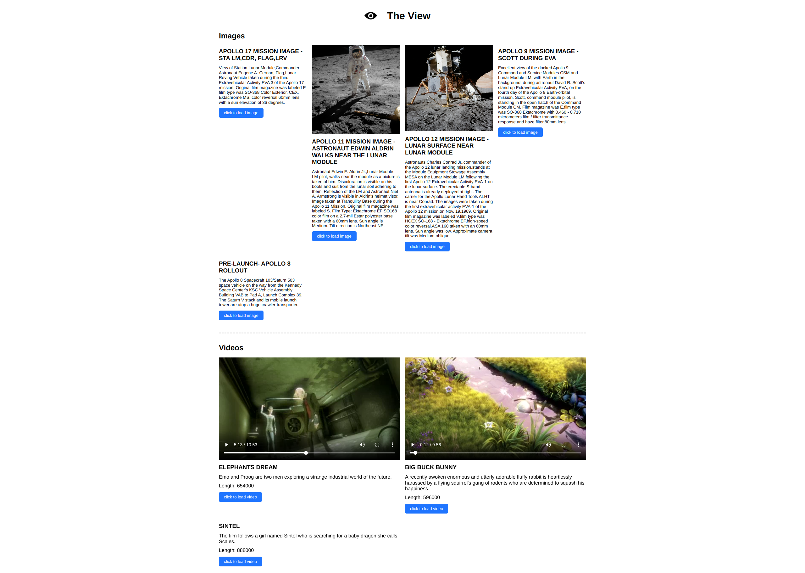

# The View 

It's a small app to try out image and video loading features. The app has a frontend and backend part. 

## How to run it 

When you have git clone the main repo, run `npm install`. Then cd to frontend and backend folder respectively, run `npm install`. Then cd back to the main project repo, type `npm run dev` you shall have the dev server running with backend at port 5000 and frontend at port 3000. 

## Backend api

You shall be able to see it as below:
`http://localhost:5000/api/videos`
`http://localhost:5000/api/images`

## Frontend 

You shall be able to see it as below:
`http://localhost:3000/`

## Features

- lazy loading: click on the buttons to load image or video (devtool > network can show how images are loaded on demand)
- autoplay: after clicking the button and video is loaded, it will automatically play 
- pause when out of view: when you scroll video out of viewport, it will pause, when you scroll it back it will resume playing, unless you click on pause manually (devtool -> if you have big screen you can use devtool to resize the screen, enable sound and you shall not hear the music once the playing video is out of viewport)

